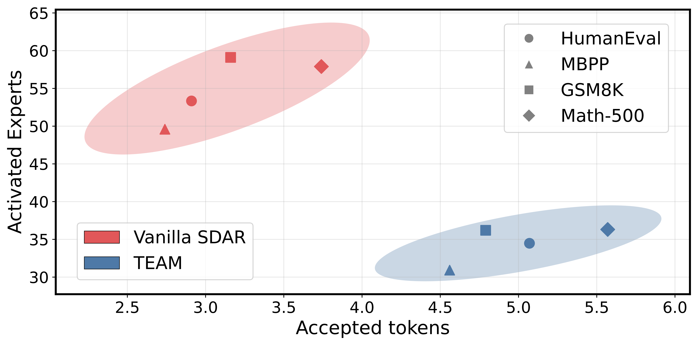
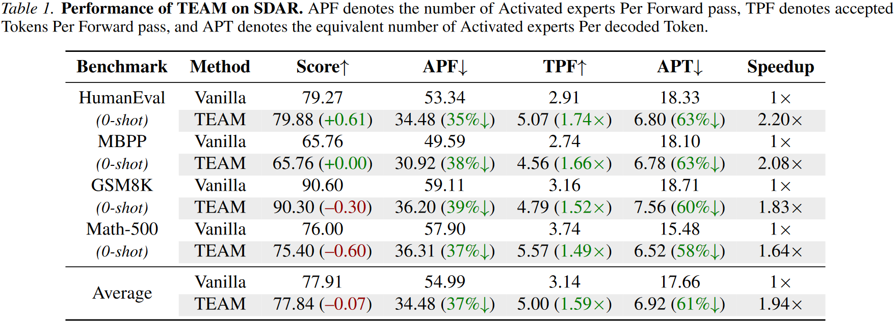

# TEAM: Temporal-Spatial Consistency Guided Expert Activation for MoE Diffusion Language Model Acceleration

<div align="center">
  
</div>

We identify a fundamental mismatch between MoE architectures and dLLM. A large number of experts are activated at each denoising step, while only a small subset of tokens is ultimately accepted, resulting in substantial inference overhead and limiting their deployment in latency-sensitive applications. 

We propose TEAM, a plug-and-play framework that accelerates MoE dLLMs by enabling more accepted tokens with fewer activated experts. TEAM employs three complementary expert activation and decoding strategies, conservatively selecting necessary experts for decoded and masked tokens and simultaneously performing aggressive speculative exploration across multiple candidates.

**Overall Performance:**

With SDAR 30B-A3B ([SDAR](https://github.com/JetAstra/SDAR)) model, TEAM achieves an average speedup of 1.94× across diverse benchmarks, with a peak speedup of up to 2.2× on the HumanEval benchmark.
<div align="center">
  
</div>

### Installation
1.Clone the repository:
```
git clone https://github.com/PKU-SEC-Lab/TEAM-MoE-dLLM.git
cd TEAM-MoE-dLLM
```
2.Install conda:
Follow #Environment Setup in SDAR/evaluation/README.md ([SDAR](https://github.com/JetAstra/SDAR))
```
TBD
```
2.Install dependencies:

```
conda create --name <your_env_name> python=3.10
conda activate <your_env_name>
```

### Usage
TBD

Example:
```
TBD
```

### Acknowledgements
This repo is largely based on [SDAR](https://github.com/JetAstra/SDAR). We would like to thank the authors of this for their excellent work and open-source contributions.

### Contact
If you have any questions, please contact us via email lywei25@stu.pku.edu.cn.

